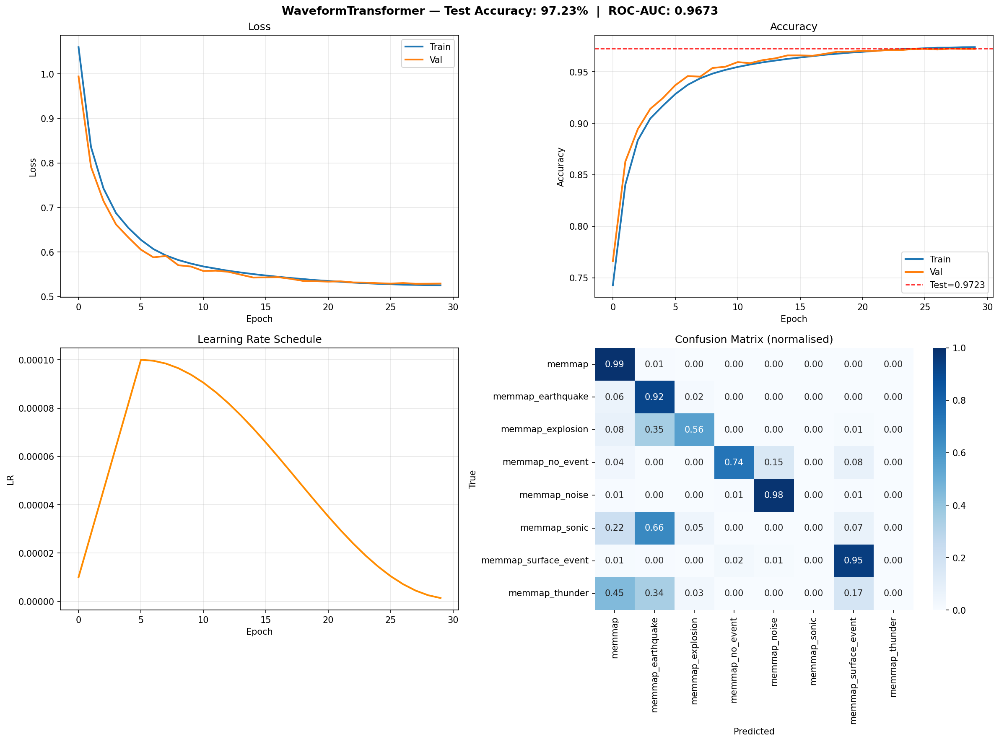
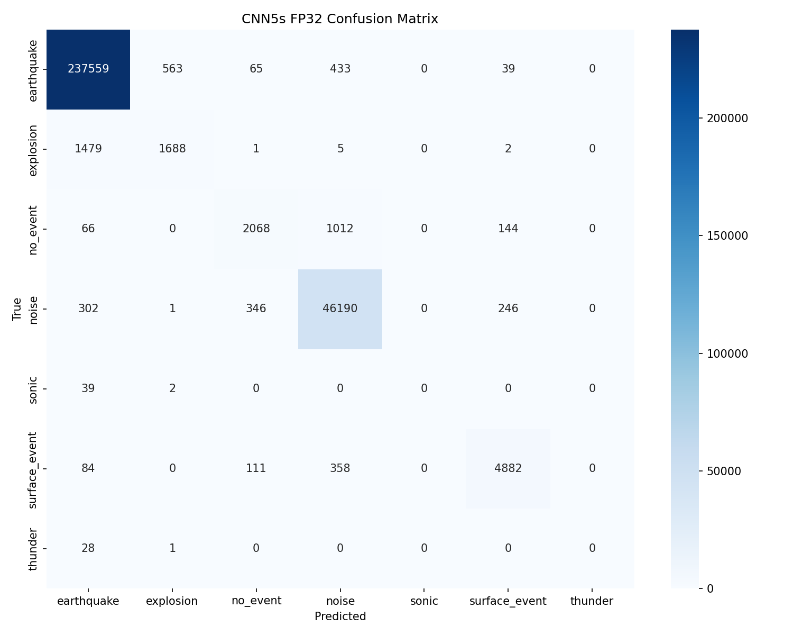

# Earthquake Classification — Klasifikasi Sinyal Seismik Berbasis Edge AI

Repository ini berisi project klasifikasi sinyal seismik berbasis deep learning untuk mengenali beberapa kategori kejadian seismik, seperti gempa, ledakan, noise, dan kejadian seismik lainnya. Project ini membandingkan beberapa arsitektur model, yaitu CNN, MobileNetV2, MobileNetV3, TCN, dan Transformer.

Project ini juga mendukung proses training, evaluasi, visualisasi hasil, optimasi model, export model, dan deployment ke perangkat edge seperti Raspberry Pi dan NVIDIA Jetson.

---

## Informasi Project

| Keterangan        | Isi                                         |
| ----------------- | ------------------------------------------- |
| Nama Project      | Earthquake Classification                   |
| Mata Kuliah       | IF3312 - Edge Artificial Intelligence       |
| Nama Kelompok     | Earthquake Classification Team              |
| Topik             | Klasifikasi sinyal seismik berbasis Edge AI |
| Platform Training | HPC / super_tailscale                       |
| Target Deployment | Raspberry Pi dan NVIDIA Jetson              |
| Jenis Data        | Waveform sinyal seismik                     |
| Jenis Klasifikasi | Multi-class classification                  |

---

## Anggota Kelompok

| Nama                       | Kontribusi                                                                   |
| -------------------------- | ---------------------------------------------------------------------------- |
| Karmila Grestiara          | Implementasi dan evaluasi model                                              |
| Fajri Adhi Guna            | Dokumentasi dan penyusunan laporan                                           |
| Nela Eka Silvia Lumbanraja | Implementasi model, evaluasi, export, deployment, dan dokumentasi repository |
| Mutia Hanifa Uyun          | Implementasi dan evaluasi model                                              |
| Nadalia Putri Khamariah    | Implementasi dan evaluasi model                                              |
| Dinda Puspita Gea          | Implementasi dan evaluasi model                                              |

---

## Deskripsi Singkat Project

Project ini menggunakan data waveform seismik tiga komponen untuk melakukan klasifikasi kejadian seismik. Data dipotong menjadi window berdurasi 5 detik, kemudian digunakan sebagai input model deep learning.

Model yang digunakan pada project ini terdiri dari:

* CNN
* MobileNetV2
* MobileNetV3
* TCN
* Transformer

Perbandingan model dilakukan untuk melihat performa dari sisi accuracy, balanced accuracy, ROC-AUC, confusion matrix, kemampuan mengenali kelas minoritas, serta kesiapan model untuk deployment pada perangkat edge.

---

## Lokasi Dataset

Dataset gabungan tidak disimpan langsung di repository karena ukurannya besar. Dataset berada pada root folder tim:

```text
/home/indra/eq_team/
├── combined_3s.npy
├── metadata_3s.npy
├── combined_5s.npy
├── metadata_5s.npy
├── combined_10s.npy
└── metadata_10s.npy
```

Dataset utama yang digunakan pada training model adalah:

```text
/home/indra/eq_team/combined_5s.npy
/home/indra/eq_team/metadata_5s.npy
```

Keterangan dataset:

| Komponen          | Keterangan       |
| ----------------- | ---------------- |
| Input             | Waveform 3 kanal |
| Kanal             | Z, N, E          |
| Durasi Window     | 5 detik          |
| Sampling Rate     | 100 Hz           |
| Panjang Input     | 500 sampel       |
| Format Data       | NumPy memmap     |
| Jenis Klasifikasi | Multi-class      |

---

## Kelas Data

Kelas yang digunakan pada project ini adalah:

```text
earthquake
explosion
no_event
noise
sonic
surface_event
thunder
```

Setiap kelas merepresentasikan jenis kejadian atau kondisi sinyal seismik yang berbeda. Kelas `earthquake` dan `noise` memiliki jumlah data yang lebih besar dibandingkan kelas minoritas seperti `explosion`, `sonic`, `surface_event`, dan `thunder`.

---

## Struktur Folder

```text
earthquake-classification/
├── PANDUAN.md
├── README.md
├── .gitignore
├── scripts/
│   ├── preprocessing/
│   └── training/
├── models/
│   ├── cnn/
│   ├── mobilenetv2/
│   ├── mobilenetv3/
│   ├── transformer/
│   └── tcn/
├── deployment/
│   └── jetson_edge_ai/
└── results/
    ├── checkpoints/
    ├── dynamic_quant_evaluation/
    ├── figures/
    ├── fp32_evaluation/
    ├── logs/
    ├── runs/
    └── tables/
```

Keterangan folder:

| Folder                                                               | Fungsi                                                       |
| -------------------------------------------------------------------- | ------------------------------------------------------------ |
| [scripts/preprocessing](scripts/preprocessing)                       | Berisi script untuk memproses dataset STEAD dan PNW          |
| [scripts/training](scripts/training)                                 | Berisi script training dan evaluasi model                    |
| [models](models)                                                     | Berisi file model hasil export                               |
| [deployment/jetson_edge_ai](deployment/jetson_edge_ai)               | Berisi file deployment dan benchmark dari NVIDIA Jetson      |
| [results/checkpoints](results/checkpoints)                           | Berisi checkpoint model hasil training                       |
| [results/figures](results/figures)                                   | Berisi gambar hasil training, evaluasi, dan confusion matrix |
| [results/logs](results/logs)                                         | Berisi log proses training                                   |
| [results/tables](results/tables)                                     | Berisi tabel metrik hasil evaluasi                           |
| [results/dynamic_quant_evaluation](results/dynamic_quant_evaluation) | Berisi hasil evaluasi model setelah dynamic quantization     |
| [results/fp32_evaluation](results/fp32_evaluation)                   | Berisi hasil evaluasi model FP32                             |

---

## Alur Project

```text
Dataset Seismik
        ↓
Preprocessing Waveform
        ↓
Training Model Deep Learning
        ↓
Evaluasi Model
        ↓
Optimasi / Quantization
        ↓
Export Model
        ↓
Deployment Edge AI
```

---

## Alur Export dan Deployment Edge AI

Model dilatih pada HPC menggunakan PyTorch. Setelah training selesai, model disimpan dalam format checkpoint PyTorch (`.pt`). Model kemudian diekspor ke format ONNX sebagai format perantara agar dapat dikonversi ke runtime deployment lain.

```text
Training di HPC
PyTorch model (.pt)
        ↓
Export ke ONNX (.onnx)
        ↓
        ├── Raspberry Pi:
        │       ONNX → TensorFlow Lite (.tflite)
        │       ↓
        │       Inference dengan TensorFlow Lite Runtime
        │
        └── NVIDIA Jetson:
                ONNX → TensorRT Engine (.engine)
                ↓
                Inference dengan TensorRT
```

Dengan demikian, file `.tflite` digunakan untuk Raspberry Pi, sedangkan file `.engine` digunakan untuk NVIDIA Jetson. File `.engine` tidak disimpan ke repository karena termasuk file runtime device dan dikecualikan melalui `.gitignore`.

---

## Model yang Digunakan

| Model       | Fungsi                                                         |
| ----------- | -------------------------------------------------------------- |
| CNN         | Baseline model untuk klasifikasi waveform seismik              |
| MobileNetV2 | Model ringan untuk deployment pada perangkat edge              |
| MobileNetV3 | Model ringan dengan efisiensi lebih baik dibanding MobileNetV2 |
| TCN         | Model temporal untuk menangkap pola waktu pada waveform        |
| Transformer | Model attention untuk menangkap hubungan global pada sinyal    |

---

## File Model

File model ONNX dan TFLite merupakan file binary, sehingga tidak dapat dipreview langsung seperti file teks di GitHub. File tersebut tetap dapat digunakan dengan cara membuka file lalu memilih **Download raw file**.

| Model       | ONNX                                                                                           | TFLite FP32                                                                                                          | TFLite FP16                                                                                                          |
| ----------- | ---------------------------------------------------------------------------------------------- | -------------------------------------------------------------------------------------------------------------------- | -------------------------------------------------------------------------------------------------------------------- |
| CNN         | [cnn_V2.onnx](models/cnn/onnx/cnn_V2.onnx)                                                     | [cnn_V2_float32.tflite](models/cnn/tflite/cnn_V2_float32.tflite)                                                     | [cnn_V2_float16.tflite](models/cnn/tflite/cnn_V2_float16.tflite)                                                     |
| MobileNetV2 | [mobilenetv2_v2.onnx](models/mobilenetv2/onnx/mobilenetv2_v2.onnx)                             | [mobilenetv2_v2_float32.tflite](models/mobilenetv2/tflite/mobilenetv2_v2_float32.tflite)                             | [mobilenetv2_v2_float16.tflite](models/mobilenetv2/tflite/mobilenetv2_v2_float16.tflite)                             |
| MobileNetV3 | [mobilenetv3_v2.onnx](models/mobilenetv3/onnx/mobilenetv3_v2.onnx)                             | [mobilenetv3_v2_float32.tflite](models/mobilenetv3/tflite/mobilenetv3_v2_float32.tflite)                             | [mobilenetv3_v2_float16.tflite](models/mobilenetv3/tflite/mobilenetv3_v2_float16.tflite)                             |
| Transformer | [waveform_transformer_teacher.onnx](models/transformer/onnx/waveform_transformer_teacher.onnx) | [waveform_transformer_teacher_float32.tflite](models/transformer/tflite/waveform_transformer_teacher_float32.tflite) | [waveform_transformer_teacher_float16.tflite](models/transformer/tflite/waveform_transformer_teacher_float16.tflite) |
| TCN         | [tcn_model.onnx](models/tcn/onnx/tcn_model.onnx)                                               | [tcn_model_float32.tflite](models/tcn/tflite/tcn_model_float32.tflite)                                               | [tcn_model_float16.tflite](models/tcn/tflite/tcn_model_float16.tflite)                                               |

---

## Cara Menjalankan Project

Aktifkan environment:

```bash
conda activate pytorch_Py12
```

Masuk ke folder project:

```bash
cd /home/indra/eq_team/earthquake-classification
```

---

## Cara Training Model

Menjalankan training CNN:

```bash
python scripts/training/script_CNN.py
```

Menjalankan training MobileNetV2:

```bash
python scripts/training/script_MobileNetV2.py
```

Menjalankan training MobileNetV3:

```bash
python scripts/training/script_mobilenetV3.py
```

Menjalankan training TCN:

```bash
python scripts/training/script_TCN.py
```

Menjalankan training Transformer:

```bash
python scripts/training/script_transformer.py
```

Output training akan otomatis tersimpan ke folder `results/`.

---

## Cara Evaluasi dan Melihat Hasil

Hasil evaluasi model dapat dilihat pada folder berikut:

```text
results/figures/
results/tables/
results/logs/
results/runs/
results/fp32_evaluation/
results/dynamic_quant_evaluation/
```

Folder `results/figures` berisi visualisasi hasil training dan confusion matrix. Folder `results/tables` berisi metrik evaluasi dalam bentuk file teks. Folder `results/logs` menyimpan log training. Folder `results/fp32_evaluation` dan `results/dynamic_quant_evaluation` digunakan untuk membandingkan performa model sebelum dan sesudah proses quantization.

---

## Hasil Evaluasi Model

| Model                | Accuracy | Balanced Accuracy | ROC-AUC Macro |
| -------------------- | -------: | ----------------: | ------------: |
| TCN                  |   0.9777 |            0.5815 |        0.9460 |
| Waveform Transformer |   0.9795 |            0.5818 |        0.9802 |

CNN, MobileNetV2, dan MobileNetV3 memiliki hasil visualisasi yang tersimpan pada folder [results/figures](results/figures). Evaluasi model tidak hanya dilihat dari accuracy, tetapi juga dari confusion matrix dan performa terhadap kelas minoritas.

---

## Deployment pada NVIDIA Jetson

Deployment pada NVIDIA Jetson dilakukan untuk menguji model klasifikasi sinyal seismik pada perangkat edge dengan akselerasi GPU. Model TCN diekspor ke ONNX, kemudian dikonversi menjadi TensorRT engine dengan presisi FP16.

Folder hasil deployment Jetson:

[deployment/jetson_edge_ai](deployment/jetson_edge_ai)

Isi folder tersebut mencakup model ONNX, model TFLite, hasil benchmark Jetson, log `tegrastats`, serta hasil benchmark TensorRT FP16 untuk model TCN.

### File Penting Deployment Jetson

| Jenis File                          | Link                                                                                                                                |
| ----------------------------------- | ----------------------------------------------------------------------------------------------------------------------------------- |
| Folder deployment Jetson            | [deployment/jetson_edge_ai](deployment/jetson_edge_ai)                                                                              |
| Folder model ONNX Jetson            | [deployment/jetson_edge_ai/models/onnx](deployment/jetson_edge_ai/models/onnx)                                                      |
| Folder model TFLite Jetson          | [deployment/jetson_edge_ai/models/tflite](deployment/jetson_edge_ai/models/tflite)                                                  |
| Folder hasil benchmark Jetson       | [deployment/jetson_edge_ai/results](deployment/jetson_edge_ai/results)                                                              |
| Folder hasil benchmark TCN TensorRT | [deployment/jetson_edge_ai/results/results_jetson](deployment/jetson_edge_ai/results/results_jetson)                                |
| TCN ONNX                            | [tcn_model.onnx](deployment/jetson_edge_ai/models/onnx/tcn_model.onnx)                                                              |
| Transformer ONNX                    | [waveform_transformer_teacher.onnx](deployment/jetson_edge_ai/models/onnx/waveform_transformer_teacher.onnx)                        |
| CNN TFLite FP32                     | [cnn_V2_float32.tflite](deployment/jetson_edge_ai/models/tflite/cnn_v2/cnn_V2_float32.tflite)                                       |
| CNN TFLite FP16                     | [cnn_V2_float16.tflite](deployment/jetson_edge_ai/models/tflite/cnn_v2/cnn_V2_float16.tflite)                                       |
| MobileNetV2 TFLite FP32             | [mobilenetv2_v2_float32.tflite](deployment/jetson_edge_ai/models/tflite/mobilenetv2_v2_float32.tflite)                              |
| MobileNetV2 TFLite FP16             | [mobilenetv2_v2_float16.tflite](deployment/jetson_edge_ai/models/tflite/mobilenetv2_v2_float16.tflite)                              |
| MobileNetV3 TFLite FP32             | [mobilenetv3_v2_float32.tflite](deployment/jetson_edge_ai/models/tflite/mobilenetv3_v2_float32.tflite)                              |
| MobileNetV3 TFLite FP16             | [mobilenetv3_v2_float16.tflite](deployment/jetson_edge_ai/models/tflite/mobilenetv3_v2_float16.tflite)                              |
| TCN TensorRT Benchmark CSV          | [tcn_tensorrt_fp16_jetson_benchmark.csv](deployment/jetson_edge_ai/results/results_jetson/tcn_tensorrt_fp16_jetson_benchmark.csv)   |
| TCN TensorRT Benchmark JSON         | [tcn_tensorrt_fp16_jetson_benchmark.json](deployment/jetson_edge_ai/results/results_jetson/tcn_tensorrt_fp16_jetson_benchmark.json) |
| TCN TensorRT Benchmark Log          | [tcn_tensorrt_fp16_jetson_benchmark.txt](deployment/jetson_edge_ai/results/results_jetson/tcn_tensorrt_fp16_jetson_benchmark.txt)   |
| Jetson Resource Log                 | [tegrastats.txt](deployment/jetson_edge_ai/results/tegrastats.txt)                                                                  |

### Command Benchmark TCN TensorRT di Jetson

```bash
cd /home/jetson/Documents/eq_team/edge_ai

/usr/src/tensorrt/bin/trtexec \
  --loadEngine=models/onnx/tcn_model_fp16.engine \
  --duration=10
```

### Hasil Benchmark TCN pada Jetson

| Model | Runtime  | Precision | Device           |  Throughput | Mean Latency | Median Latency |
| ----- | -------- | --------- | ---------------- | ----------: | -----------: | -------------: |
| TCN   | TensorRT | FP16      | Jetson Orin Nano | 1525.96 qps |  0.671629 ms |    0.670898 ms |

Detail hasil benchmark:

| Metrik          |       Nilai |
| --------------- | ----------: |
| Throughput      | 1525.96 qps |
| Mean Latency    | 0.671629 ms |
| Median Latency  | 0.670898 ms |
| P90 Latency     | 0.676270 ms |
| P95 Latency     | 0.678101 ms |
| P99 Latency     | 0.682648 ms |
| GPU Mean Time   | 0.651406 ms |
| GPU Median Time | 0.650391 ms |

Hasil benchmark menunjukkan bahwa TensorRT FP16 pada Jetson mampu menjalankan model TCN dengan latency rendah. Hal ini menunjukkan bahwa model TCN sudah layak untuk inferensi cepat pada perangkat edge.

---

## Hasil Benchmark Deployment Edge

| Perangkat     | Runtime                 | Model                                           | Hasil                      | File                                                                                                            |
| ------------- | ----------------------- | ----------------------------------------------- | -------------------------- | --------------------------------------------------------------------------------------------------------------- |
| Raspberry Pi  | TensorFlow Lite Runtime | TCN TFLite FP32                                 | Mean latency 414.06 ms     | [results](results)                                                                                              |
| NVIDIA Jetson | TensorRT FP16           | TCN TensorRT Engine                             | Median latency 0.670898 ms | [TCN Jetson Benchmark](deployment/jetson_edge_ai/results/results_jetson/tcn_tensorrt_fp16_jetson_benchmark.csv) |
| HPC           | PyTorch / CUDA          | CNN, MobileNetV2, MobileNetV3, TCN, Transformer | Training dan export model  | [results](results)                                                                                              |

---

# Visualisasi dan Penjelasan Setiap Figure

Bagian ini menjelaskan setiap figure yang terdapat pada folder [results/figures](results/figures) dan folder evaluasi. Setiap figure digunakan untuk melihat proses training, performa validasi, confusion matrix, serta kemampuan model dalam mengklasifikasikan setiap kelas.

---

## 1. CNN Results


Link file: [cnn_5s_results.png](results/figures/cnn_5s_results.png)

Figure ini menampilkan hasil evaluasi model CNN pada data waveform berdurasi 5 detik. CNN digunakan sebagai baseline karena arsitekturnya relatif sederhana dan dapat menangkap pola lokal pada sinyal seismik.

Figure ini menampilkan kurva training, kurva validasi, dan confusion matrix model. Kurva training digunakan untuk melihat bagaimana loss dan accuracy berubah selama proses pelatihan. Kurva validasi digunakan untuk melihat apakah model mampu melakukan generalisasi terhadap data yang tidak digunakan saat training.

Confusion matrix pada figure ini menunjukkan perbandingan antara label sebenarnya dan hasil prediksi model. Nilai pada diagonal utama menunjukkan prediksi yang benar, sedangkan nilai di luar diagonal menunjukkan kesalahan prediksi. Jika beberapa kelas minoritas lebih sering salah diprediksi sebagai kelas mayoritas, maka model masih dipengaruhi oleh ketidakseimbangan data.

Kesimpulan dari figure ini adalah CNN dapat digunakan sebagai model baseline, tetapi performanya tetap perlu dibandingkan dengan arsitektur lain yang lebih ringan atau lebih kuat untuk data time-series.

---

## 2. CNN Results V2


Link file: [cnn_5s_results_v2.png](results/figures/cnn_5s_results_v2.png)

Figure ini merupakan hasil evaluasi CNN versi lanjutan. Figure ini digunakan untuk membandingkan performa CNN setelah dilakukan perubahan konfigurasi, perbaikan proses training, atau penyesuaian evaluasi.

Figure ini menampilkan perkembangan performa CNN setelah proses revisi. Perbandingan dilakukan dengan melihat kestabilan kurva loss, peningkatan accuracy, dan distribusi prediksi pada confusion matrix.

Jika confusion matrix menunjukkan nilai diagonal yang lebih besar dibandingkan versi sebelumnya, maka CNN V2 memiliki kemampuan klasifikasi yang lebih baik. Namun, jika kesalahan prediksi masih banyak terjadi pada kelas minoritas, maka masalah utama kemungkinan berasal dari distribusi data yang tidak seimbang.

Kesimpulan dari figure ini adalah CNN V2 digunakan sebagai pembanding untuk melihat apakah perubahan konfigurasi dapat meningkatkan hasil baseline CNN.

---

## 3. MobileNetV2 Results


Link file: [mobilenetv2_results.png](results/figures/mobilenetv2_results.png)

Figure ini menampilkan hasil training dan evaluasi model MobileNetV2. MobileNetV2 digunakan karena arsitekturnya ringan dan cocok untuk perangkat edge dengan sumber daya terbatas.

Figure ini menampilkan kurva loss, kurva accuracy, dan confusion matrix. Kurva loss digunakan untuk melihat apakah model semakin baik dalam mempelajari data. Kurva accuracy digunakan untuk melihat peningkatan performa model selama training dan validasi.

Confusion matrix MobileNetV2 menunjukkan kemampuan model dalam membedakan setiap kelas seismik. Sebagai model ringan, MobileNetV2 diharapkan memiliki performa yang cukup baik dengan ukuran model yang lebih kecil dibandingkan model besar.

Kesimpulan dari figure ini adalah MobileNetV2 cocok digunakan sebagai kandidat model edge karena lebih ringan, tetapi tetap perlu dievaluasi terhadap kelas minoritas.

---

## 4. MobileNetV2 Results V2


Link file: [mobilenetv2_results_v2.png](results/figures/mobilenetv2_results_v2.png)

Figure ini merupakan hasil evaluasi MobileNetV2 versi lanjutan. Figure ini digunakan sebagai pembanding terhadap hasil MobileNetV2 sebelumnya.

Figure ini menunjukkan apakah perubahan training, hyperparameter, atau strategi evaluasi memberikan peningkatan performa. Jika kurva validation loss lebih stabil dan confusion matrix menunjukkan lebih banyak nilai benar pada diagonal, maka versi V2 memiliki performa yang lebih baik.

Figure ini juga membantu menilai apakah MobileNetV2 tetap layak digunakan pada data multi-class seismik. Karena model ini ringan, hasil evaluasinya penting untuk menentukan apakah MobileNetV2 dapat diterapkan pada perangkat edge.

Kesimpulan dari figure ini adalah MobileNetV2 V2 digunakan untuk melihat peningkatan performa dari versi awal, terutama dari sisi kestabilan training dan hasil klasifikasi.

---

## 5. MobileNetV3 Results


Link file: [mobilenetv3_results.png](results/figures/mobilenetv3_results.png)

Figure ini menunjukkan hasil evaluasi MobileNetV3. MobileNetV3 merupakan pengembangan dari MobileNetV2 dengan arsitektur yang lebih efisien untuk perangkat edge.

Figure ini menampilkan performa model selama training dan validasi. Kurva loss dan accuracy digunakan untuk melihat apakah model belajar dengan stabil. Jika accuracy training dan validation meningkat secara bersamaan, maka proses training berjalan baik. Jika terdapat selisih besar antara training dan validation accuracy, maka model berpotensi mengalami overfitting.

Confusion matrix pada figure ini menunjukkan kemampuan MobileNetV3 dalam mengklasifikasikan setiap kelas. Model ini diharapkan mampu memberikan keseimbangan antara performa klasifikasi dan efisiensi komputasi.

Kesimpulan dari figure ini adalah MobileNetV3 menjadi kandidat model edge yang lebih efisien dibandingkan MobileNetV2, tetapi tetap harus diuji berdasarkan hasil confusion matrix.

---

## 6. MobileNetV3 Results V2


Link file: [mobilenetv3_results_v2.png](results/figures/mobilenetv3_results_v2.png)

Figure ini merupakan hasil evaluasi MobileNetV3 versi kedua. Figure ini digunakan untuk melihat perkembangan performa dibandingkan versi awal.

Figure ini membantu mengevaluasi apakah perubahan konfigurasi training membuat model lebih stabil. Hal tersebut dapat dilihat dari kurva loss yang lebih halus, validation accuracy yang lebih baik, serta confusion matrix yang memiliki lebih banyak nilai benar pada diagonal utama.

Jika beberapa kelas minoritas masih memiliki hasil prediksi rendah, maka masalah utama bukan hanya arsitektur model, tetapi juga distribusi dataset yang tidak seimbang.

Kesimpulan dari figure ini adalah MobileNetV3 V2 digunakan untuk melihat dampak perbaikan training terhadap performa model.

---

## 7. MobileNetV3 Results V3


Link file: [mobilenetv3_results_v3.png](results/figures/mobilenetv3_results_v3.png)

Figure ini merupakan hasil evaluasi MobileNetV3 versi ketiga. Figure ini digunakan sebagai hasil lanjutan untuk melihat peningkatan atau perubahan performa dari versi sebelumnya.

Figure ini penting karena dapat menunjukkan apakah model semakin baik setelah dilakukan penyesuaian pada proses training. Jika confusion matrix menunjukkan distribusi prediksi yang lebih seimbang antar kelas, maka model memiliki kemampuan generalisasi yang lebih baik.

Namun, jika hasil masih dominan pada kelas besar seperti `earthquake` dan `noise`, maka model masih dipengaruhi oleh ketidakseimbangan data. Hal ini perlu diperhatikan karena accuracy tinggi belum tentu menunjukkan bahwa model berhasil mengenali semua kelas secara merata.

Kesimpulan dari figure ini adalah MobileNetV3 V3 digunakan sebagai hasil lanjutan untuk menilai performa final MobileNetV3.

---

## 8. TCN Results Final


Link file: [tcn_results_final.png](results/figures/tcn_results_final.png)

Figure ini menampilkan hasil akhir model TCN. TCN digunakan karena cocok untuk data time-series seperti waveform seismik. Model ini dapat menangkap pola temporal pada sinyal melalui temporal convolution.

Figure ini menampilkan proses pembelajaran model selama training dan hasil evaluasi pada data uji. Kurva loss dan accuracy digunakan untuk melihat kestabilan training, sedangkan confusion matrix digunakan untuk melihat distribusi prediksi benar dan salah pada setiap kelas.

Hasil TCN menunjukkan accuracy yang tinggi, yaitu sekitar 97%. Namun, balanced accuracy masih lebih rendah karena beberapa kelas minoritas sulit dikenali. Hal ini menunjukkan bahwa model sangat baik dalam mengenali kelas mayoritas, tetapi masih perlu peningkatan untuk kelas dengan jumlah data sedikit.

Kesimpulan dari figure ini adalah TCN memiliki performa tinggi untuk klasifikasi sinyal seismik, terutama karena arsitekturnya sesuai untuk data temporal.

---

## 9. Transformer Results Final 2



Link file: [transformer_results_final2.png](results/figures/transformer_results_final2.png)

Figure ini menunjukkan hasil evaluasi Transformer pada salah satu konfigurasi final. Transformer digunakan karena memiliki mekanisme attention yang mampu menangkap hubungan global antar bagian sinyal.

Pada data waveform seismik, Transformer dapat mempelajari pola yang tersebar sepanjang window sinyal. Figure ini digunakan untuk melihat performa Transformer dari sisi kurva training dan confusion matrix.

Jika confusion matrix menunjukkan prediksi yang kuat pada diagonal utama, maka Transformer berhasil mengenali pola setiap kelas. Namun, karena Transformer memiliki kompleksitas lebih tinggi, model ini membutuhkan sumber daya komputasi yang lebih besar dibandingkan model ringan seperti MobileNet.

Kesimpulan dari figure ini adalah Transformer mampu memberikan performa tinggi, tetapi memiliki kebutuhan komputasi yang lebih besar dibandingkan model ringan.

---

## 10. Transformer Results Final 3


Link file: [transformer_results_final3.png](results/figures/transformer_results_final3.png)

Figure ini merupakan hasil evaluasi Transformer versi final lainnya. Figure ini digunakan untuk membandingkan hasil Transformer setelah dilakukan penyesuaian konfigurasi training atau evaluasi.

Figure ini membantu melihat apakah performa Transformer lebih stabil dibandingkan hasil sebelumnya. Jika kurva validation loss tidak meningkat tajam dan accuracy validasi tetap stabil, maka model tidak mengalami overfitting yang besar.

Confusion matrix pada figure ini menunjukkan kemampuan Transformer dalam membedakan kelas seismik. Hasil Transformer penting sebagai pembanding terhadap TCN karena keduanya sama-sama cocok untuk data berurutan, tetapi memiliki pendekatan arsitektur yang berbeda.

Kesimpulan dari figure ini adalah Transformer Results Final 3 digunakan sebagai salah satu hasil final untuk melihat kestabilan dan kemampuan generalisasi model Transformer.

---

## 11. Confusion Matrix FP32 Evaluation



Link file: [confusion_matrix_fp32.png](results/fp32_evaluation/confusion_matrix_fp32.png)

Figure ini menampilkan confusion matrix model dalam format FP32. FP32 merupakan format presisi penuh yang digunakan sebagai baseline sebelum dilakukan optimasi atau quantization.

Confusion matrix FP32 digunakan sebagai acuan untuk melihat performa model sebelum dikompresi. Nilai pada diagonal utama menunjukkan prediksi benar, sedangkan nilai di luar diagonal menunjukkan kesalahan klasifikasi.

Hasil FP32 kemudian dibandingkan dengan hasil dynamic quantization. Perbandingan ini penting untuk melihat apakah proses optimasi menyebabkan penurunan performa yang signifikan atau tidak.

Kesimpulan dari figure ini adalah evaluasi FP32 digunakan sebagai pembanding utama sebelum model dioptimasi untuk perangkat edge.

File evaluasi:

* [Classification Report FP32](results/fp32_evaluation/classification_report_fp32.txt)

---

## 12. Confusion Matrix Dynamic Quantized


Link file: [confusion_matrix_dynamic_quantized.png](results/dynamic_quant_evaluation/confusion_matrix_dynamic_quantized.png)

Figure ini menampilkan confusion matrix setelah model diterapkan dynamic quantization. Dynamic quantization digunakan untuk mengurangi ukuran model dan mempercepat inferensi, terutama pada perangkat edge.

Confusion matrix ini digunakan untuk melihat apakah model quantized masih mampu mempertahankan pola prediksi yang baik. Jika hasil diagonal utama masih tinggi dan pola kesalahan tidak jauh berbeda dari FP32, maka quantization tidak terlalu merusak performa model.

Evaluasi ini penting karena deployment pada perangkat edge membutuhkan model yang ringan dan cepat. Dengan quantization, model dapat lebih efisien digunakan pada perangkat dengan memori dan komputasi terbatas.

Kesimpulan dari figure ini adalah dynamic quantization membantu menyiapkan model agar lebih efisien untuk deployment edge tanpa menghilangkan pola performa utama model.

File evaluasi:

* [Classification Report Dynamic Quantized](results/dynamic_quant_evaluation/classification_report_dynamic_quantized.txt)
* Checkpoint model: `results/dynamic_quant_evaluation/best_cnn_5s_dynamic_quantized.pt`

---

## 13. Explosion Fix Verification


Link file: [explosion_fix_verification.png](results/figures/explosion_fix_verification.png)

Figure ini digunakan untuk memverifikasi perbaikan pada kelas `explosion`. Kelas explosion merupakan salah satu kelas minoritas yang cenderung sulit dikenali oleh model karena jumlah datanya lebih sedikit dibandingkan kelas besar.

Figure ini membantu memastikan apakah perubahan preprocessing, label mapping, atau konfigurasi training sudah memperbaiki deteksi terhadap kelas explosion. Jika hasil setelah perbaikan menunjukkan prediksi explosion yang lebih baik, maka proses perbaikan berhasil meningkatkan sensitivitas model terhadap kelas tersebut.

Figure ini penting karena model yang hanya memiliki accuracy tinggi belum tentu mampu mengenali kelas minoritas. Dengan adanya verifikasi khusus untuk explosion, evaluasi menjadi lebih detail dan tidak hanya berfokus pada kelas mayoritas.

Kesimpulan dari figure ini adalah kelas explosion perlu dianalisis secara khusus karena termasuk kelas minoritas yang rawan tidak terdeteksi oleh model.

---

## 14. Explosion Zero Diagnosis


Link file: [explosion_zero_diagnosis.png](results/figures/explosion_zero_diagnosis.png)

Figure ini digunakan untuk mendiagnosis masalah ketika kelas `explosion` tidak terdeteksi atau memiliki hasil prediksi yang sangat rendah. Masalah ini dapat terjadi karena jumlah data explosion sedikit, distribusi kelas tidak seimbang, atau pola sinyal explosion mirip dengan kelas lain.

Diagnosis ini membantu melihat apakah kesalahan berasal dari data, label, preprocessing, atau model. Jika kelas explosion sering diprediksi sebagai kelas lain, maka perlu dilakukan strategi tambahan seperti class weighting, oversampling, augmentasi data, atau penyesuaian loss function.

Figure ini menjadi bukti bahwa evaluasi tidak hanya dilakukan secara umum, tetapi juga memperhatikan masalah spesifik pada kelas minoritas.

Kesimpulan dari figure ini adalah masalah deteksi kelas explosion perlu ditangani melalui strategi data balancing atau penyesuaian training agar model lebih adil terhadap kelas minoritas.

---

## Ringkasan File Figure

| No | Figure                             | Link File                                                                                                         | Fungsi                               |
| -: | ---------------------------------- | ----------------------------------------------------------------------------------------------------------------- | ------------------------------------ |
|  1 | CNN Results                        | [cnn_5s_results.png](results/figures/cnn_5s_results.png)                                                          | Evaluasi awal model CNN              |
|  2 | CNN Results V2                     | [cnn_5s_results_v2.png](results/figures/cnn_5s_results_v2.png)                                                    | Evaluasi lanjutan model CNN          |
|  3 | MobileNetV2 Results                | [mobilenetv2_results.png](results/figures/mobilenetv2_results.png)                                                | Evaluasi awal MobileNetV2            |
|  4 | MobileNetV2 Results V2             | [mobilenetv2_results_v2.png](results/figures/mobilenetv2_results_v2.png)                                          | Evaluasi lanjutan MobileNetV2        |
|  5 | MobileNetV3 Results                | [mobilenetv3_results.png](results/figures/mobilenetv3_results.png)                                                | Evaluasi awal MobileNetV3            |
|  6 | MobileNetV3 Results V2             | [mobilenetv3_results_v2.png](results/figures/mobilenetv3_results_v2.png)                                          | Evaluasi lanjutan MobileNetV3        |
|  7 | MobileNetV3 Results V3             | [mobilenetv3_results_v3.png](results/figures/mobilenetv3_results_v3.png)                                          | Evaluasi final MobileNetV3           |
|  8 | TCN Results Final                  | [tcn_results_final.png](results/figures/tcn_results_final.png)                                                    | Evaluasi final TCN                   |
|  9 | Transformer Results Final 2        | [transformer_results_final2.png](results/figures/transformer_results_final2.png)                                  | Evaluasi Transformer                 |
| 10 | Transformer Results Final 3        | [transformer_results_final3.png](results/figures/transformer_results_final3.png)                                  | Evaluasi final Transformer           |
| 11 | FP32 Confusion Matrix              | [confusion_matrix_fp32.png](results/fp32_evaluation/confusion_matrix_fp32.png)                                    | Evaluasi model presisi penuh         |
| 12 | Dynamic Quantized Confusion Matrix | [confusion_matrix_dynamic_quantized.png](results/dynamic_quant_evaluation/confusion_matrix_dynamic_quantized.png) | Evaluasi model setelah quantization  |
| 13 | Explosion Fix Verification         | [explosion_fix_verification.png](results/figures/explosion_fix_verification.png)                                  | Verifikasi perbaikan kelas explosion |
| 14 | Explosion Zero Diagnosis           | [explosion_zero_diagnosis.png](results/figures/explosion_zero_diagnosis.png)                                      | Diagnosis masalah kelas explosion    |

---

## Ringkasan File Deployment Jetson

| No | File / Folder                | Link                                                                                                                                | Keterangan                                      |
| -: | ---------------------------- | ----------------------------------------------------------------------------------------------------------------------------------- | ----------------------------------------------- |
|  1 | Folder Jetson                | [deployment/jetson_edge_ai](deployment/jetson_edge_ai)                                                                              | Folder utama hasil deployment Jetson            |
|  2 | Model ONNX Jetson            | [models/onnx](deployment/jetson_edge_ai/models/onnx)                                                                                | Folder model ONNX yang dipakai pada Jetson      |
|  3 | Model TFLite Jetson          | [models/tflite](deployment/jetson_edge_ai/models/tflite)                                                                            | Folder model TFLite yang disalin dari Jetson    |
|  4 | Hasil Benchmark Jetson       | [results](deployment/jetson_edge_ai/results)                                                                                        | Folder hasil benchmark dan log Jetson           |
|  5 | Hasil Benchmark TCN TensorRT | [results_jetson](deployment/jetson_edge_ai/results/results_jetson)                                                                  | Folder benchmark TensorRT FP16 untuk TCN        |
|  6 | TCN Benchmark CSV            | [tcn_tensorrt_fp16_jetson_benchmark.csv](deployment/jetson_edge_ai/results/results_jetson/tcn_tensorrt_fp16_jetson_benchmark.csv)   | Ringkasan hasil benchmark TCN dalam format CSV  |
|  7 | TCN Benchmark JSON           | [tcn_tensorrt_fp16_jetson_benchmark.json](deployment/jetson_edge_ai/results/results_jetson/tcn_tensorrt_fp16_jetson_benchmark.json) | Ringkasan hasil benchmark TCN dalam format JSON |
|  8 | TCN Benchmark Log            | [tcn_tensorrt_fp16_jetson_benchmark.txt](deployment/jetson_edge_ai/results/results_jetson/tcn_tensorrt_fp16_jetson_benchmark.txt)   | Log lengkap hasil `trtexec`                     |
|  9 | Jetson Resource Log          | [tegrastats.txt](deployment/jetson_edge_ai/results/tegrastats.txt)                                                                  | Log resource Jetson saat pengujian              |

---

## Catatan Ketidakseimbangan Kelas

Akurasi total model cukup tinggi karena dataset didominasi oleh kelas besar seperti `earthquake` dan `noise`. Namun, balanced accuracy lebih rendah karena kelas minoritas seperti `explosion`, `sonic`, dan `thunder` memiliki jumlah data yang jauh lebih sedikit.

Oleh karena itu, evaluasi tidak hanya menggunakan accuracy. Metrik seperti balanced accuracy, macro precision, macro recall, macro F1-score, dan ROC-AUC macro juga digunakan agar performa model terhadap semua kelas dapat terlihat lebih adil.

---

## Catatan Repository

Dataset mentah, file `.npy`, `.npz`, checkpoint besar, dan file hasil training berukuran besar tidak disimpan langsung ke GitHub. File tersebut dikecualikan melalui `.gitignore` agar repository tetap ringan dan aman untuk diakses.

File yang dikecualikan:

```text
*.npy
*.npz
*.pt
*.pth
*.engine
data/
results/checkpoints/
__pycache__/
```

---

## Tautan Repository, Laporan, dan Demo

| Jenis Dokumen     | Link                                                                                             |
| ----------------- | ------------------------------------------------------------------------------------------------ |
| Repository GitHub | https://github.com/nela-lumbanraja/earthquake-edge-ai                                            |
| Laporan Project   | https://docs.google.com/document/d/1XKaMQf30A4EUqPDUG5OZLLvG92JMg9NQtOuWlwN6X1c/edit?usp=sharing |
| Video Demo        | [masukkan link video demo]                                                                       |

---

## Kesimpulan

Project ini menunjukkan proses lengkap pengembangan model klasifikasi sinyal seismik berbasis Edge AI, mulai dari preprocessing data, training model deep learning, evaluasi performa, visualisasi hasil, optimasi model, export model, hingga persiapan deployment pada perangkat edge.

Hasil evaluasi menunjukkan bahwa model seperti TCN dan Transformer mampu menghasilkan accuracy yang tinggi. Namun, karena dataset memiliki ketidakseimbangan kelas, evaluasi tetap perlu memperhatikan balanced accuracy dan performa pada kelas minoritas.

Dengan adanya confusion matrix, figure diagnosis, evaluasi FP32, evaluasi dynamic quantization, serta hasil benchmark Jetson, proses analisis model menjadi lebih jelas. Project ini juga menunjukkan bahwa model dapat dipersiapkan untuk deployment pada perangkat edge seperti Raspberry Pi dan NVIDIA Jetson.
