# Earthquake Classification — Klasifikasi Sinyal Seismik

Proyek klasifikasi sinyal seismik berbasis deep learning: mengklasifikasikan
window waveform 3-komponen ke dalam beberapa kategori sumber (gempa, ledakan,
noise, dll.) dan membandingkan beberapa arsitektur (CNN, MobileNetV2/V3, TCN,
Transformer).

> Panduan lengkap (latar belakang ilmiah, tinjauan SOTA, konvensi tim, roadmap)
> ada di [`PANDUAN.md`](PANDUAN.md).
>
> Catatan: implementasi saat ini sudah berkembang dari rencana awal di PANDUAN
> (binary *EQ vs noise*) menjadi **multi-class** (8 kelas gabungan STEAD + PNW).

## Lokasi Dataset (PENTING)

Dataset gabungan (memmap) **TIDAK** disimpan di folder proyek ini, melainkan
tetap di **root tim** `/home/indra/eq_team/` karena ukurannya besar (±32 GB) dan
dipakai bersama:

```
/home/indra/eq_team/
├── combined_3s.npy    metadata_3s.npy
├── combined_5s.npy    metadata_5s.npy     ← dipakai semua script training
└── combined_10s.npy   metadata_10s.npy
```

- `combined_<sec>.npy` — memmap waveform, shape `(N, 3, T)` float32
  (baca `shape`/`dtype` dari metadata).
- `metadata_<sec>.npy` — dict (`np.load(..., allow_pickle=True).item()`) berisi
  `label`, `shape`, `dtype`, plus `p_arrival_sample`, `snr_db`,
  `source_magnitude`, `source_distance_km`.
- Dihasilkan oleh `scripts/preprocessing/combine_by_seconds_npy.py` dari memmap
  per-kelas di `/home/indra/indra/STEAD` dan `/home/indra/indra/PNW`.

Semua script training membaca data lewat konstanta `DATA_DIR =
"/home/indra/eq_team"`. **Output** (checkpoint, figure, log, metrik) ditulis ke
`results/` di dalam folder proyek ini.

## Struktur Folder

```
earthquake-classification/
├── PANDUAN.md                    ← panduan proyek (dari pembimbing)
├── README.md                     ← file ini
├── .gitignore
├── scripts/
│   ├── preprocessing/            ← bangun dataset dari STEAD/PNW
│   │   ├── script_noise.py  script_no_event.py
│   │   ├── script_PNW_earthquake.py  _explosion  _sonic  _surface_event  _thunder.py
│   │   └── combine_by_seconds_npy.py   ← gabung semua kelas → combined_*.npy (di root tim)
│   └── training/                 ← latih & evaluasi model
│       ├── script_CNN.py         script_MobileNetV2.py   script_mobilenetV3.py
│       └── script_TCN.py         script_transformer.py
└── results/
    ├── checkpoints/              ← best_<model>_5s.pt
    ├── figures/                  ← <model>_results*.png (confusion matrix, kurva training)
    ├── logs/                     ← *.log, *_training_log.json
    └── tables/                   ← *_test_metrics.txt
```

## Cara Menjalankan

```bash
conda activate pytorch_Py12
cd /home/indra/eq_team/earthquake-classification

# Script memakai path absolut, jadi aman dijalankan dari folder mana pun.
python scripts/training/script_transformer.py
```

Output otomatis masuk ke `results/` (checkpoint → `checkpoints/`, plot →
`figures/`, log → `logs/`, metrik → `tables/`).

## Hasil (test set, window 5 detik)

| Model               | Accuracy | Balanced Acc | ROC-AUC (macro) |
|---------------------|----------|--------------|-----------------|
| TCN                 | 0.9777   | 0.5815       | 0.9460          |
| WaveformTransformer | 0.9795   | 0.5818       | 0.9802          |

CNN, MobileNetV2, dan MobileNetV3: checkpoint + confusion matrix tersimpan di
`results/`; metrik ringkasnya belum diekspor ke `tables/`.

> **Catatan ketidakseimbangan kelas.** Akurasi total tinggi (~98%) didominasi
> kelas besar (`memmap` / STEAD-earthquake ≈ 206k, `memmap_noise` ≈ 47k).
> Balanced accuracy rendah (~58%) karena kelas minoritas (`explosion`, `sonic`,
> `thunder` — masing-masing < 3.2k, bahkan < 50 sampel) hampir tidak terdeteksi.
> Strategi penanganan: lihat §8.2 PANDUAN.
## Hasil Output dan Evaluasi Model

Bagian ini menampilkan hasil training, evaluasi, confusion matrix, dan visualisasi dari setiap model yang digunakan pada project klasifikasi sinyal seismik.

---

### CNN

#### CNN Results

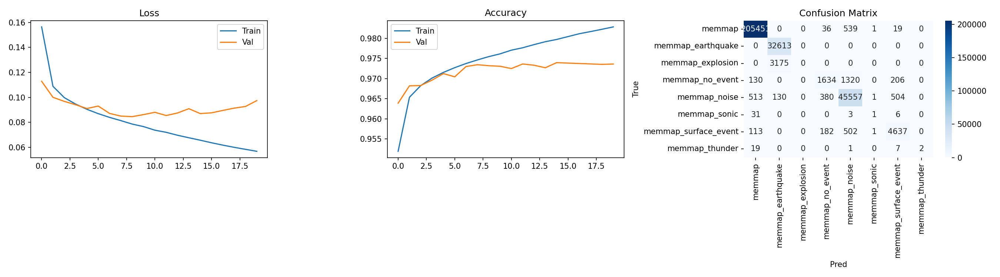

#### CNN Results V2

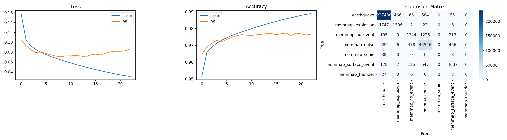

---

### MobileNetV2

#### MobileNetV2 Results

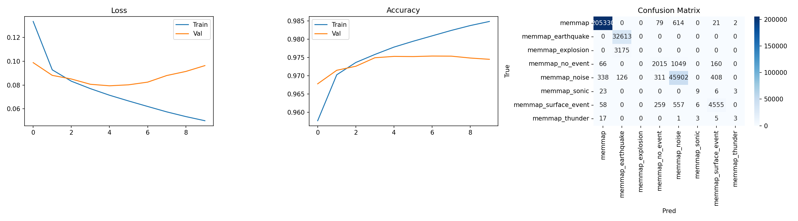

#### MobileNetV2 Results V2

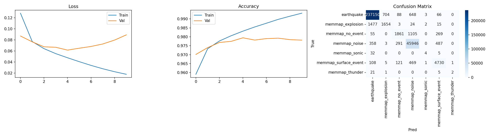

---

### MobileNetV3

#### MobileNetV3 Results

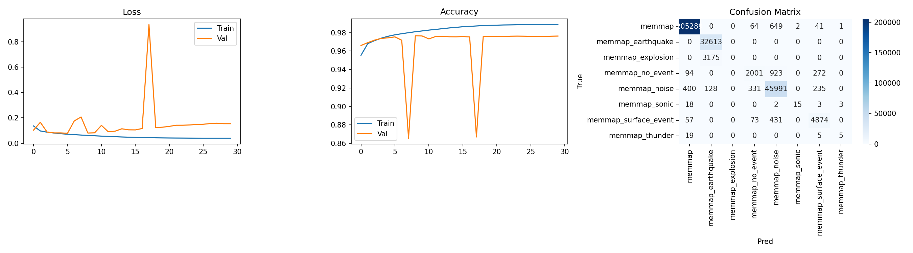

#### MobileNetV3 Results V2

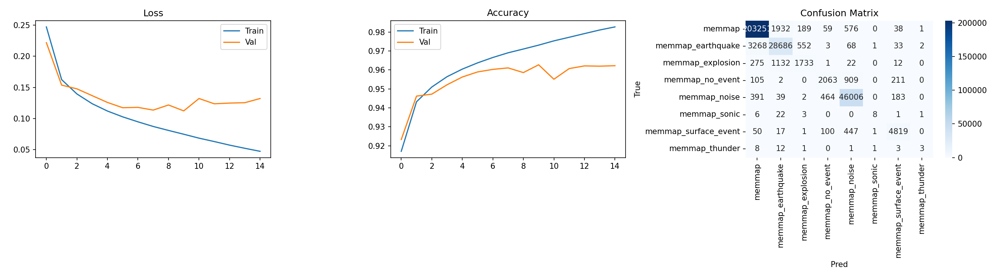

#### MobileNetV3 Results V3

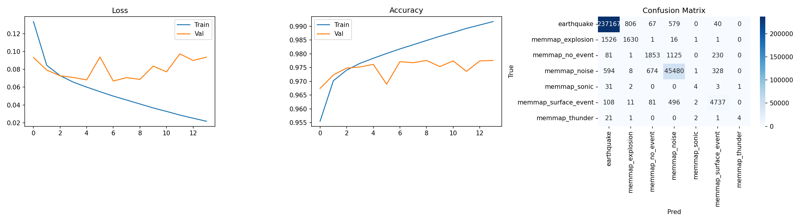

---

### TCN

#### TCN Results Final

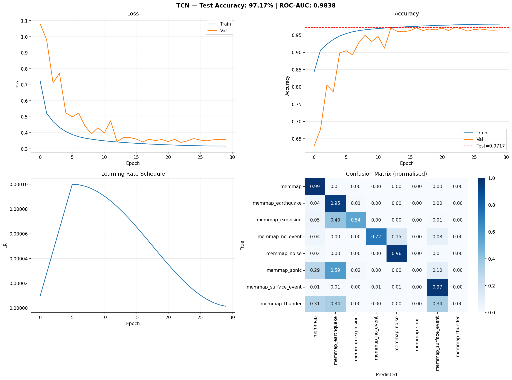

---

### Transformer

#### Transformer Results Final 3

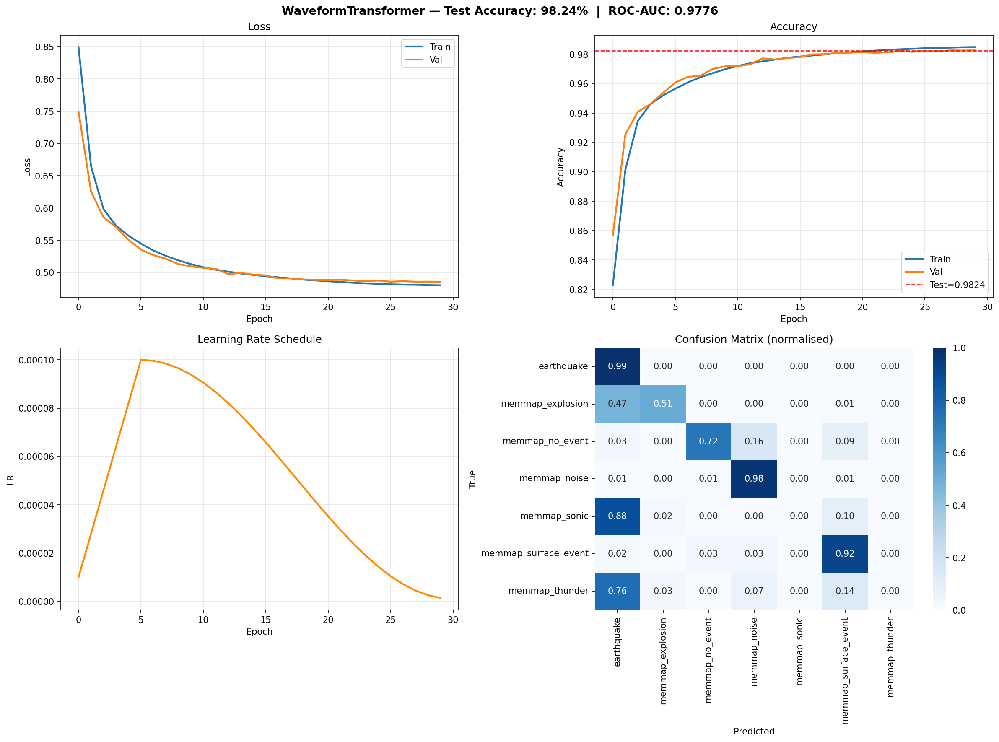

---

### Evaluasi Dynamic Quantization

Dynamic quantization digunakan untuk mengurangi ukuran model dan meningkatkan efisiensi inferensi pada perangkat edge.

#### Confusion Matrix Dynamic Quantized

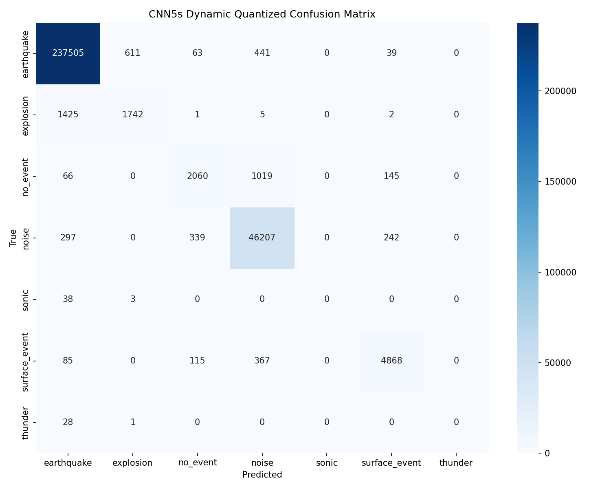

File evaluasi:

* [Classification Report Dynamic Quantized](results/dynamic_quant_evaluation/classification_report_dynamic_quantized.txt)
* Checkpoint model: `results/dynamic_quant_evaluation/best_cnn_5s_dynamic_quantized.pt`

---

### Evaluasi Tambahan

#### Explosion Fix Verification

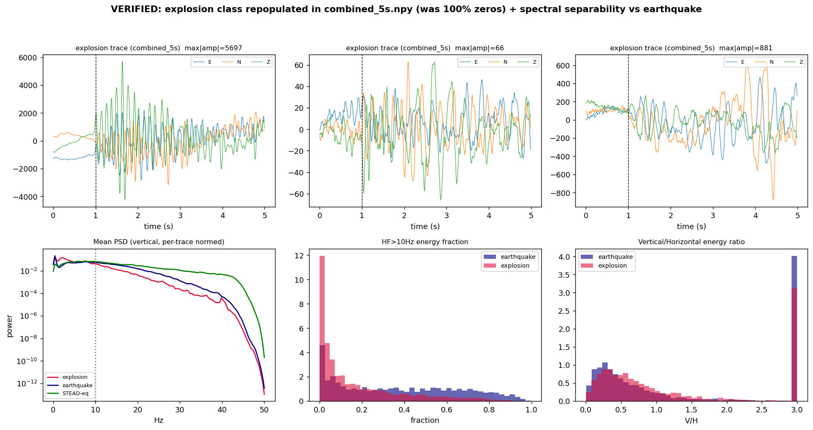

#### Explosion Zero Diagnosis

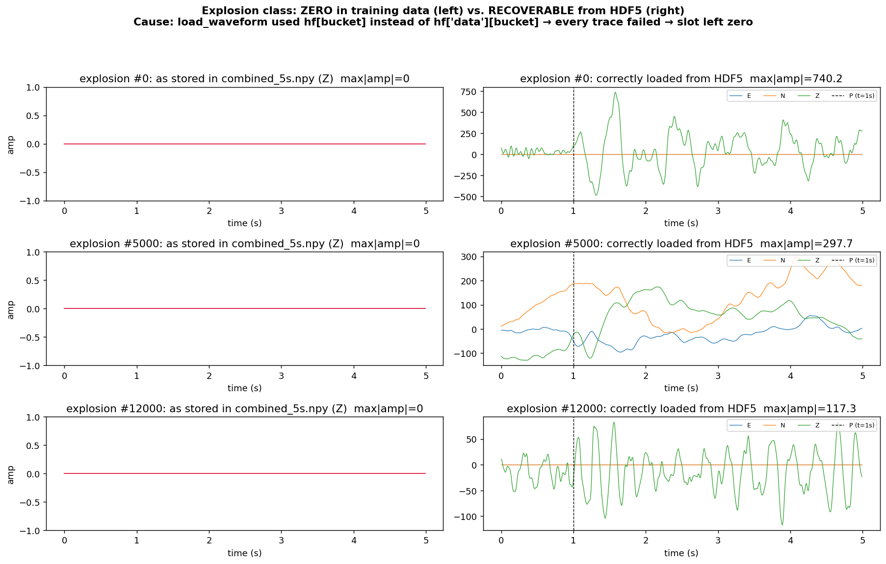

---

## Ringkasan File Hasil

| Jenis Hasil                        | Path                                                                           |
| ---------------------------------- | ------------------------------------------------------------------------------ |
| CNN Results                        | `results/figures/cnn_5s_results.png`                                           |
| CNN Results V2                     | `results/figures/cnn_5s_results_v2.png`                                        |
| MobileNetV2 Results                | `results/figures/mobilenetv2_results.png`                                      |
| MobileNetV2 Results V2             | `results/figures/mobilenetv2_results_v2.png`                                   |
| MobileNetV3 Results                | `results/figures/mobilenetv3_results.png`                                      |
| MobileNetV3 Results V2             | `results/figures/mobilenetv3_results_v2.png`                                   |
| MobileNetV3 Results V3             | `results/figures/mobilenetv3_results_v3.png`                                   |
| TCN Results Final                  | `results/figures/tcn_results_final.png`                                        |
| Transformer Results Final 3        | `results/figures/transformer_results_final3.png`                               |
| Dynamic Quantized Report           | `results/dynamic_quant_evaluation/classification_report_dynamic_quantized.txt` |
| Dynamic Quantized Confusion Matrix | `results/dynamic_quant_evaluation/confusion_matrix_dynamic_quantized.png`      |
## Hasil Output dan Evaluasi Model

Bagian ini menampilkan hasil training, evaluasi, confusion matrix, dan visualisasi dari setiap model yang digunakan pada project klasifikasi sinyal seismik.

---

### CNN

#### CNN Results


#### CNN Results V2


---

### MobileNetV2

#### MobileNetV2 Results


#### MobileNetV2 Results V2


---

### MobileNetV3

#### MobileNetV3 Results


#### MobileNetV3 Results V2


#### MobileNetV3 Results V3


---

### TCN

#### TCN Results Final


---

### Transformer

#### Transformer Results Final 3


---

### Evaluasi Dynamic Quantization

Dynamic quantization digunakan untuk mengurangi ukuran model dan meningkatkan efisiensi inferensi pada perangkat edge.

#### Confusion Matrix Dynamic Quantized


File evaluasi:

* [Classification Report Dynamic Quantized](results/dynamic_quant_evaluation/classification_report_dynamic_quantized.txt)
* Checkpoint model: `results/dynamic_quant_evaluation/best_cnn_5s_dynamic_quantized.pt`

---

### Evaluasi Tambahan

#### Explosion Fix Verification


#### Explosion Zero Diagnosis


---

## Ringkasan File Hasil

| Jenis Hasil                        | Path                                                                           |
| ---------------------------------- | ------------------------------------------------------------------------------ |
| CNN Results                        | `results/figures/cnn_5s_results.png`                                           |
| CNN Results V2                     | `results/figures/cnn_5s_results_v2.png`                                        |
| MobileNetV2 Results                | `results/figures/mobilenetv2_results.png`                                      |
| MobileNetV2 Results V2             | `results/figures/mobilenetv2_results_v2.png`                                   |
| MobileNetV3 Results                | `results/figures/mobilenetv3_results.png`                                      |
| MobileNetV3 Results V2             | `results/figures/mobilenetv3_results_v2.png`                                   |
| MobileNetV3 Results V3             | `results/figures/mobilenetv3_results_v3.png`                                   |
| TCN Results Final                  | `results/figures/tcn_results_final.png`                                        |
| Transformer Results Final 3        | `results/figures/transformer_results_final3.png`                               |
| Dynamic Quantized Report           | `results/dynamic_quant_evaluation/classification_report_dynamic_quantized.txt` |
| Dynamic Quantized Confusion Matrix | `results/dynamic_quant_evaluation/confusion_matrix_dynamic_quantized.png`      |
